# Smart Home Energy Management System

A comprehensive multi-agent system for optimizing energy consumption, comfort, and costs in smart homes using AI-powered decision making.

## 🏠 Overview

This project implements a sophisticated smart home energy management system that uses multiple specialized AI agents to coordinate and optimize various aspects of home energy usage. The system leverages Google's Gemini LLM for intelligent decision-making, Elasticsearch for vector storage, and Redis for agent communication.

## ✨ Key Features

- **Multi-Agent Architecture**: 9 specialized agents working collaboratively
- **AI-Powered Decision Making**: Uses Google Gemini LLM for intelligent optimization
- **Real-time Energy Monitoring**: Tracks consumption patterns and detects anomalies
- **Dynamic Pricing Optimization**: Adjusts usage based on time-of-use pricing
- **Comfort-First Approach**: Balances energy efficiency with user comfort
- **Solar Integration**: Optimizes solar generation and battery storage
- **EV Charging Management**: Smart scheduling for electric vehicle charging
- **Demand Response**: Participates in utility demand response programs
- **Learning System**: Adapts to user preferences over time

## 🏗️ System Architecture


## 🤖 Agent Communication Flow

```mermaid
sequenceDiagram
    participant User
    participant N as Negotiator Agent
    participant EM as Energy Monitor
    participant PI as Price Intelligence
    participant H as HVAC Agent
    participant CO as Comfort Optimization
    participant DS as Device Service
    
    User->>+CO: Adjust temperature to 74°F
    CO->>+N: Request temperature change
    N->>+EM: Check current consumption
    EM-->>-N: High consumption detected
    N->>+PI: Get current pricing
    PI-->>-N: Peak pricing period
    N->>+H: Negotiate temperature adjustment
    H->>+DS: Check HVAC capacity
    DS-->>-H: Current system status
    H-->>-N: Compromise: 73°F with efficiency mode
    N-->>-CO: Approved with modification
    CO-->>-User: Temperature set to 73°F (peak pricing optimization)
    
    Note over N: Central coordination ensures<br/>system-wide optimization
```



## 🔄 Agent Decision-Making Process


## 📁 Project Structure

```
smart_home_energy_system/
├── README.md                          # This file
├── requirements.txt                   # Python dependencies
├── .env.example                      # Environment variables template
├── main.py                           # Application entry point
├── config/
│   ├── __init__.py
│   ├── settings.py                   # Application configuration
│   └── elasticsearch_config.py      # Elasticsearch setup
├── core/                             # Core system components
│   ├── __init__.py
│   ├── base_agent.py                # Base agent class
│   ├── llm_client.py                # Gemini LLM integration
│   ├── embedding_service.py         # mxbai embedding service
│   ├── database.py                  # Elasticsearch interface
│   └── message_broker.py            # Redis message broker
├── agents/                           # Specialized agents
│   ├── __init__.py
│   ├── energy_monitor_agent.py      # Energy consumption monitoring
│   ├── price_intelligence_agent.py  # Energy pricing optimization
│   ├── hvac_agent.py               # HVAC system management
│   ├── appliance_agent.py          # Smart appliance control
│   ├── lighting_agent.py           # Lighting optimization
│   ├── ev_charging_agent.py        # EV charging management
│   ├── solar_battery_agent.py      # Solar and battery optimization
│   ├── comfort_optimization_agent.py # User comfort management
│   └── negotiator_agent.py         # Central coordination
├── services/                         # External service interfaces
│   ├── __init__.py
│   ├── device_service.py           # Smart device interface
│   ├── weather_service.py          # Weather data service
│   └── pricing_service.py          # Energy pricing service
├── models/                          # Data models
│   ├── __init__.py
│   ├── energy_data.py              # Energy-related data models
│   ├── device_data.py              # Device-related data models
│   └── user_preferences.py         # User preference models
├── utils/                           # Utility functions
│   ├── __init__.py
│   ├── logger.py                   # Logging configuration
│   └── helpers.py                  # Helper functions
├── tests/                          # Test suites
│   ├── __init__.py
│   ├── test_agents.py              # Agent tests
│   └── test_services.py            # Service tests
└── data/                           # Sample data and configurations
    ├── sample_data.json            # Sample energy data
    └── device_configs.json         # Device configurations
```

## 🚀 Quick Start

### Prerequisites

- Python 3.9+
- Elasticsearch 8.0+
- Redis 6.0+
- Google Gemini API access
- mxbai embedding model access

### Installation

1. **Clone the repository**
   ```bash
   git clone <repository-url>
   cd smart_home_energy_system
   ```

2. **Install dependencies**
   ```bash
   pip install -r requirements.txt
   ```

3. **Set up Elasticsearch**
   ```bash
   # Download and start Elasticsearch
   wget https://artifacts.elastic.co/downloads/elasticsearch/elasticsearch-8.11.0-linux-x86_64.tar.gz
   tar -xzf elasticsearch-8.11.0-linux-x86_64.tar.gz
   cd elasticsearch-8.11.0/
   ./bin/elasticsearch
   ```

4. **Set up Redis**
   ```bash
   # Install and start Redis
   sudo apt-get install redis-server
   redis-server
   ```

5. **Configure environment variables**
   ```bash
   cp .env.example .env
   # Edit .env with your API keys and configuration
   ```

6. **Environment Configuration (.env)**
   ```env
   # Gemini LLM Configuration
   GEMINI_API_KEY=your_gemini_api_key_here
   GEMINI_MODEL=gemini-pro
   
   # Elasticsearch Configuration
   ELASTICSEARCH_HOST=localhost
   ELASTICSEARCH_PORT=9200
   ELASTICSEARCH_INDEX_PREFIX=smart_home
   
   # Embedding Model Configuration
   EMBEDDING_MODEL=mixedbread-ai/mxbai-embed-large-v1
   
   # Redis Configuration
   REDIS_HOST=localhost
   REDIS_PORT=6379
   REDIS_DB=0
   
   # Logging
   LOG_LEVEL=INFO
   DEBUG=false
   ```

7. **Initialize the system**
   ```bash
   python main.py
   ```

## 🎯 Usage Examples

### Starting the System

```python
import asyncio
from main import SmartHomeEnergySystem

async def main():
    system = SmartHomeEnergySystem()
    await system.start()
    
    # System will run until interrupted
    try:
        while True:
            await asyncio.sleep(60)  # Run for 1 minute intervals
    except KeyboardInterrupt:
        await system.stop()

if __name__ == "__main__":
    asyncio.run(main())
```

### Interacting with Agents

```python
# Request current energy status
energy_status = await energy_monitor_agent.handle_request(
    sender="user",
    data={
        "request_type": "get_consumption_data",
        "hours": 24
    }
)

# Set comfort preferences
comfort_response = await comfort_agent.handle_request(
    sender="user", 
    data={
        "request_type": "set_comfort_preferences",
        "preferences": {
            "temperature": {
                "heating_setpoint": 68,
                "cooling_setpoint": 75
            }
        }
    }
)

# Schedule appliance operation
appliance_response = await appliance_agent.handle_request(
    sender="user",
    data={
        "request_type": "schedule_operation",
        "appliance_id": "dishwasher_main",
        "operation": "normal_wash",
        "delay_tolerance": 4  # hours
    }
)
```

## 🧠 Agent Descriptions

### 1. **Negotiator Agent** (Central Coordinator)
- **Role**: Central decision-making and conflict resolution
- **Responsibilities**: 
  - Coordinates between all agents
  - Resolves resource conflicts
  - Maintains system priorities
  - Ensures optimal system-wide decisions

### 2. **Energy Monitor Agent**
- **Role**: Energy consumption tracking and analysis
- **Responsibilities**:
  - Real-time consumption monitoring
  - Anomaly detection
  - Efficiency analysis
  - Usage pattern recognition

### 3. **Price Intelligence Agent**
- **Role**: Energy pricing optimization
- **Responsibilities**:
  - Track dynamic energy pricing
  - Forecast price trends
  - Identify optimal usage windows
  - Demand response coordination

### 4. **HVAC Agent**
- **Role**: Heating, ventilation, and air conditioning management
- **Responsibilities**:
  - Temperature control optimization
  - Energy-efficient operation
  - Comfort maintenance
  - Schedule-based adjustments

### 5. **Appliance Agent**
- **Role**: Smart appliance coordination
- **Responsibilities**:
  - Optimal scheduling of appliance operations
  - Load balancing
  - Energy-efficient cycles
  - User preference integration

### 6. **Lighting Agent**
- **Role**: Intelligent lighting management
- **Responsibilities**:
  - Daylight harvesting
  - Circadian rhythm lighting
  - Occupancy-based control
  - Energy optimization

### 7. **EV Charging Agent**
- **Role**: Electric vehicle charging optimization
- **Responsibilities**:
  - Smart charging schedules
  - Solar integration
  - Load balancing
  - Departure time optimization

### 8. **Solar Battery Agent**
- **Role**: Renewable energy and storage management
- **Responsibilities**:
  - Solar generation optimization
  - Battery storage management
  - Grid interaction control
  - Backup power management

### 9. **Comfort Optimization Agent**
- **Role**: User comfort and preference management
- **Responsibilities**:
  - Comfort score calculation
  - User preference learning
  - Comfort-efficiency balance
  - Personalization

## 🔧 Configuration

### Agent Configuration

Each agent can be configured through environment variables or configuration files:

```python
# Example HVAC Agent configuration
HVAC_CONFIG = {
    "temperature_tolerance": 2.0,  # ±2°F
    "setback_temperature": 5.0,    # 5°F setback when away
    "efficiency_priority": 0.7,    # 70% efficiency, 30% comfort
    "learning_enabled": True
}
```

### Device Integration

Add new devices by updating the device configuration:

```json
{
  "device_id": "smart_thermostat_01",
  "device_type": "hvac",
  "device_subtype": "thermostat",
  "name": "Living Room Thermostat",
  "room": "living_room",
  "power_rating": 3500,
  "capabilities": ["heating", "cooling", "scheduling"]
}
```

## 📊 Monitoring and Analytics

The system provides comprehensive monitoring through:

- **Real-time Dashboards**: Energy consumption, cost tracking, efficiency metrics
- **Agent Performance**: Decision accuracy, response times, learning progress
- **Device Health**: Operational status, maintenance alerts, efficiency scores
- **User Satisfaction**: Comfort scores, preference alignment, feedback integration

## 🔒 Security and Privacy

- **Data Encryption**: All sensitive data encrypted at rest and in transit
- **Access Control**: Role-based access to system components
- **Privacy Protection**: User data anonymization and local processing
- **Audit Logging**: Comprehensive audit trail of all system actions

## 🧪 Testing

Run the test suite:

```bash
# Run all tests
python -m pytest tests/

# Run specific test categories
python -m pytest tests/test_agents.py
python -m pytest tests/test_services.py

# Run with coverage
python -m pytest --cov=smart_home_energy_system tests/
```

## 📈 Performance Optimization

### Scaling Considerations

- **Horizontal Scaling**: Deploy multiple instances of agents
- **Database Optimization**: Elasticsearch cluster configuration
- **Caching**: Redis-based caching for frequently accessed data
- **Load Balancing**: Distribute agent workloads

### Resource Requirements

- **Minimum**: 4GB RAM, 2 CPU cores, 10GB storage
- **Recommended**: 8GB RAM, 4 CPU cores, 50GB storage
- **Production**: 16GB RAM, 8 CPU cores, 100GB+ storage

## 🤝 Contributing

1. Fork the repository
2. Create a feature branch (`git checkout -b feature/amazing-feature`)
3. Commit your changes (`git commit -m 'Add amazing feature'`)
4. Push to the branch (`git push origin feature/amazing-feature`)
5. Open a Pull Request

### Development Guidelines

- Follow PEP 8 style guidelines
- Add comprehensive docstrings
- Include unit tests for new features
- Update documentation as needed

## 🐛 Troubleshooting

### Common Issues

1. **Elasticsearch Connection Failed**
   ```bash
   # Check if Elasticsearch is running
   curl -X GET "localhost:9200/_cluster/health"
   ```

2. **Redis Connection Failed**
   ```bash
   # Check Redis status
   redis-cli ping
   ```

3. **Agent Communication Issues**
   ```bash
   # Check message broker queue status
   redis-cli info stats
   ```

4. **High Memory Usage**
   - Reduce embedding dimension
   - Implement data retention policies
   - Optimize Elasticsearch mappings

### Debug Mode

Enable debug mode for detailed logging:

```bash
export DEBUG=true
export LOG_LEVEL=DEBUG
python main.py
```

## 📋 Roadmap

### Phase 1 (Current)
- [x] Multi-agent architecture implementation
- [x] Basic energy monitoring and optimization
- [x] LLM integration for decision making
- [x] Device service interfaces

### Phase 2 (Next)
- [ ] Advanced machine learning models
- [ ] Mobile application interface
- [ ] Voice control integration
- [ ] Weather prediction improvements

### Phase 3 (Future)
- [ ] Grid-scale integration
- [ ] Community energy sharing
- [ ] Advanced predictive analytics
- [ ] IoT device ecosystem expansion

## 📄 License

This project is licensed under the MIT License - see the [LICENSE](LICENSE) file for details.

## 🙏 Acknowledgments

- Google Gemini for advanced LLM capabilities
- Elasticsearch for vector search and storage
- mxbai for high-quality embeddings
- Redis for reliable message brokering
- The open-source community for various libraries and tools

## 📞 Support

For support and questions:

- Create an issue on GitHub
- Check the documentation wiki
- Join our community discussions

---

**Built with ❤️ for a sustainable energy future**